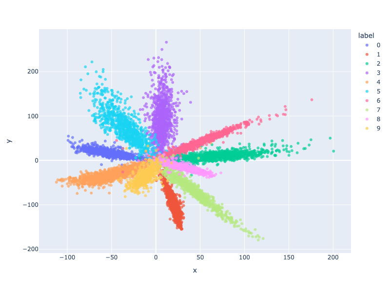

# Introduction to Machine Translation

## Introduction

Machine translation refers to the automatic translation of text from one language to another. It is a subfield of computational linguistics and artificial intelligence. The goal of machine translation is to produce translations that are fluent and accurate, conveying the meaning of the original text.

Usually, nowadays, machine translation systems are based on neural networks, which have achieved state-of-the-art performance in many language pairs. These systems are trained on large amounts of parallel text data, which consists of pairs of sentences in two languages.

## NLP and Machine Translation

NLP refers to the field of study that focuses on the interactions between computers and humans through natural language. Machine translation is one of the key applications of NLP, as it involves the automatic translation of text from one language to another.

More generally speaking, NLP consists of four major tasks- sequence-to-sequence modeling, text classification, text generation, and text summarization. Machine translation falls under the sequence-to-sequence modeling category, where the goal is to map an input sequence of words in one language to an output sequence of words in another language.

## Major Concepts in NLP

### Tokenization

Tokenization refers to the process of breaking down text into smaller units, such as words or subwords. This is an essential step in many NLP tasks, including machine translation, as it allows the model to process text at a more granular level.

Usually, tokenization involves splitting text on whitespace or punctuation, but more advanced methods, such as subword tokenization, can be used to handle out-of-vocabulary words.

Sometimes, there will be special words, aka special tokens, to signal extra information, like start of the sentence, end of the sentence, or padding. A usual way to handle this is to add a special token to the input and output sequences, like `<sos>` for start of sentence, `<eos>` for end of sentence, and `<pad>` for padding.

Nowadays, the best library to use for NLP is the transformers library, which is built on top of pytorch.

To create a custom tokenizer in the transformers library, we can use the `PreTrainedTokenizer` class. A simple example of a custom tokenizer is shown below.

```python
from transformers import PreTrainedTokenizer

class CustomTokenizer(PreTrainedTokenizer):
    def __init__(self, vocab_file, tokenizer_file):
        super(CustomTokenizer, self).__init__(vocab_file, tokenizer_file)
    
    def _tokenize(self, text):
        return text.split()
    
    def _convert_token_to_id(self, token):
        return self.vocab[token]
    
    def _convert_id_to_token(self, index):
        return self.ids_to_tokens[index]
```

To add special tokens to pre-trained tokenizer, we can use the `add_special_tokens` method. If simply expanding the vocab, use `add_tokens`. A simple example of adding special tokens to a pre-trained tokenizer is shown below.

```python
from transformers import BertTokenizer

tokenizer = BertTokenizer.from_pretrained('bert-base-uncased')
num_added_tokens = tokenizer.add_tokens(["new_token1", "my_new-token2"])
special_tokens_dict = {"cls_token": "[MY_CLS]"}
num_added_tokens = tokenizer.add_special_tokens(special_tokens_dict)
```

### Embedding

On a greater level, embedding refers to the process of converting the input to a dense vector representation. This is done by mapping the input to a high-dimensional space, where similar inputs are closer together.

Below is an example of training an embedding on the MNIST dataset:

```python
import torch as th
import torch.nn as nn
from torchvision import datasets, transforms

# get the minst dataset
def get_mnist_data():
    # load the data
    mnist_train = datasets.MNIST('data', train=True, download=True, transform=transforms.ToTensor())
    mnist_test = datasets.MNIST('data', train=False, download=True, transform=transforms.ToTensor())

    # create the data loaders
    train_loader = th.utils.data.DataLoader(mnist_train, batch_size=64, shuffle=True)
    test_loader = th.utils.data.DataLoader(mnist_test, batch_size=64, shuffle=False)

    return train_loader, test_loader

class MNISTEmbedding(nn.Module):
    
    # To a 2 dimensional space
    # Use a two-stack of convolutional layers
    def __init__(self, input_size=28, channels_hidden=32, mlp_hidden = 128):
        super(MNISTEmbedding, self).__init__()
        # [btach, 1, x, y]
        # [batch, 1, x, y] -> [batch, channels_hidden, x, y]
        self.conv1 = nn.Conv2d(1, channels_hidden, kernel_size=3, stride=1, padding=1)
        # [batch, channels_hidden, x, y] -> [batch, channels_hidden, x, y]
        self.conv2 = nn.Conv2d(channels_hidden, channels_hidden, kernel_size=3, stride=1, padding=1)
        # [batch, channels_hidden, x, y] -> [batch, channels_hidden * x * y]
        self.flatten = nn.Flatten()
        # [batch, channels_hidden * x * y] -> [batch, 2]
        self.mlp = nn.Sequential(
            nn.Linear(channels_hidden * (input_size ** 2), mlp_hidden),
            nn.ReLU(),
            nn.Linear(mlp_hidden, mlp_hidden),
            nn.ReLU(),
            nn.Linear(mlp_hidden, 2)
        )

    def forward(self, x):
        x = self.conv1(x)
        x = self.conv2(x)
        x = self.flatten(x)
        x = self.mlp(x)
        return x
    
class MNISTModel(nn.Module):
    
    def __init__(self, input_size=28, channels_hidden=32, mlp_hidden=128, embedding_to_result_hidden = 32):
        super(MNISTModel, self).__init__()
        self.embedding = MNISTEmbedding(input_size, channels_hidden, mlp_hidden)
        self.lc_in = nn.Linear(2, embedding_to_result_hidden)
        self.relu = nn.ReLU()
        self.lc_out = nn.Linear(embedding_to_result_hidden, 10)
    
    def forward(self, x):
        x = self.embedding(x)
        x = self.lc_in(x)
        x = self.relu(x)
        x = self.lc_out(x)
        return x

# train the model
device = "mps"
train_loader, test_loader = get_mnist_data()
model = MNISTModel().to(device=device, dtype=th.float32)
optimizer = th.optim.Adam(model.parameters(), lr=1e-4)

epochs = 20
logging_steps = 400

from tqdm.notebook import tqdm, trange

for epoch in trange(epochs):
    for i, (x, y) in enumerate(tqdm(train_loader)):
        x = x.to(device=device, dtype=th.float32)
        y = y.to(device=device, dtype=th.float32)

        optimizer.zero_grad()
        y_pred = model(x)
        loss = th.nn.functional.cross_entropy(y_pred, y.long())
        loss.backward()
        optimizer.step()

        if i % logging_steps == 0:
            print(f"Epoch {epoch}, step {i}, loss {loss.item()}")

model = model.eval()
embedding = model.embedding

# Convert test data to embedding vectors
embeddings = []
labels = []
for x, y in tqdm(test_loader):
    x = x.to(device=device, dtype=th.float32)
    y = y.to(device=device, dtype=th.float32)
    with th.no_grad():
        e = embedding(x)
    # flatten the batch dimension
    # detach then extend
    embeddings.extend(e.detach().cpu().numpy().tolist())
    labels.extend(y.detach().cpu().numpy().tolist())

labels = list(map(lambda x: int(x), labels))
import plotly.express as px
import pandas as pd

# Plot the embeddings with plotly
df = pd.DataFrame(embeddings, columns=["x", "y"])
df["label"] = list(map(str, labels))
# labels are discrete, so we can use category
fig = px.scatter(df, x="x", y="y", color="label", opacity=0.7, category_orders={"label": [str(i) for i in range(10)]})
# enlarge the size of the graph
fig.update_layout(width=800, height=600)
fig.show()
```

The embedding can be visualized as shown below:



In NLP, embeddings is largely word embeddings, which are dense vector representations of words. These embeddings are trained on large amounts of text data and capture semantic and syntactic information about words.

There is a simpler ways to create embedding models with `torch.nn.Embedding`:

```python
# Create an embedding layer with 1000 words and 100 dimensions
embedding = nn.Embedding(1000, 100)
```

The input of the embedding layer is the index of the word in the vocabulary, that is, a vector of integers. The output of the embedding layer is a dense vector representation of the word, which can be used as input to a neural network model.

Embeddings converts the input to a dense vector representation, which can be used as input to a neural network model. Taking the output of the middle layer of a neural network model, we also get an embedding of the output. 

### Encoder-Decoder

Encoder and decoder are two components of a sequence-to-sequence model. The encoder takes an input sequence and encodes it into a fixed-length vector representation, which is then passed to the decoder to generate the output sequence.

For example, the encoder can be a model that takes an input sentence in English and encodes it into a fixed-length vector representation, which is then passed to the decoder to generate the next token in the output sentence. Usually doing so in a loop until decoder generates the end of sentence token.

### RNN

RNNs, or Recurrent Neural Networks, are a type of neural network that is designed to handle sequential data. They are particularly well-suited for tasks such as machine translation, where the input and output sequences are of variable length.

A simple RNN model in pytorch is shown below:

```python
import torch
import torch.nn as nn

class RNN(nn.Module):
    def __init__(self, input_size, hidden_size, output_size):
        super(RNN, self).__init__()
        self.hidden_size = hidden_size
        self.i2h = nn.Linear(input_size + hidden_size, hidden_size)
        self.i2o = nn.Linear(input_size + hidden_size, output_size)
        self.softmax = nn.LogSoftmax(dim=1)

    def forward(self, input, hidden):
        combined = torch.cat((input, hidden), 1)
        hidden = self.i2h(combined)
        output = self.i2o(combined)
        output = self.softmax(output)
        return output, hidden

    def initHidden(self):
        return torch.zeros(1, self.hidden_size)
```

That is, there are two states in the RNN model, the hidden state and the output state. The hidden state is updated by the input and the previous hidden state, and the output state is updated by the input and the hidden state. During each passing, the hidden state and the output state are updated together.

A more commonly used model is the LSTM, long-short term memory model, which is an improved version of the RNN model. The LSTM model has a cell state, which allows it to remember information over long sequences.

There is also a RNN model called GRU, gated recurrent unit, which is a simplified version of the LSTM model, also very useful in NLP tasks.

LSTM and GRU models are built-in in pytorch.

## First Solution to Machine Translation

The first solution would be a encoder-RNN-decoder model. The encoder takes the input sentence and encodes it into a fixed-length vector representation, which is then passed to the decoder to generate the output sentence.

A basic encoder-decoder model is implemented under the code, task one folder. Which, doesn't perform well- or any at all, but it is a good starting point to understand the basic concepts of machine translation.

Please notice that this is a oversimplified version that doesn't even perform in the task. And no terminology-based method, as the contest requires, is used in this model. Terminologies are only used to expand the vocabulary of the model. This is different from the provided model.

### Dataloader

First, load the data.

```python
class MTTrainDataset(Dataset):
    
    
    def __init__(self, train_path, dic_path):
        self.terms = [
            {"en": l.split("\t")[0], "zh": l.split("\t")[1]} for l in open(dic_path).read().split("\n")[:-1]
        ]
        self.data = [
            {"en": l.split("\t")[0], "zh": l.split("\t")[1]} for l in open(train_path).read().split("\n")[:-1]
        ]
        self.en_tokenizer = AutoTokenizer.from_pretrained("google-bert/bert-base-uncased", cache_dir="../../../cache")
        self.ch_tokenizer = AutoTokenizer.from_pretrained("google-bert/bert-base-chinese", cache_dir="../../../cache")
        self.en_tokenizer.add_tokens([
            term["en"] for term in self.terms
        ])
        self.ch_tokenizer.add_tokens([
            term["zh"] for term in self.terms
        ])
                
    def __len__(self):
        return len(self.data)
    
    def __getitem__(self, index) -> dict:
        return {
            "en": self.en_tokenizer.encode(self.data[index]["en"]),
            "zh": self.ch_tokenizer.encode(self.data[index]["zh"]),
        }
    
    def get_raw(self, index):
        return self.data[index]

ds = MTTrainDataset("./data/train.txt", "./data/en-zh.dic")
```

### Encoder

Create the encoder, encoder first does embedding, then use RNN to encode the input.

```python
# Encoder encodes the input sequence into a sequence of hidden states
class Encoder(nn.Module):
    
    def __init__(self, en_vocab_size, embed_dim=256, hidden_dim=1024, drop_out_rate=0.1):
        super(Encoder, self).__init__()
        self.hidden_dim = hidden_dim
        # [batch, len] -> [batch, len, embed_dim]
        self.embed = nn.Embedding(en_vocab_size, embed_dim)
        # [len, batch, embed_dim] -> [len, batch, hidden_dim], [n_layers == 1, batch, hidden_dim]
        self.gru = nn.GRU(embed_dim, hidden_dim)
        self.dropout = nn.Dropout(drop_out_rate)
    
    def init_hidden(self, batch_size):
        # [n_layers == 1, batch, hidden_dim]
        return th.zeros(1, batch_size, self.hidden_dim).to(device)
    
    def forward(self, x):
        x = self.embed(x)
        x = self.dropout(x)
        h = self.init_hidden(x.size(0))
       
```

### Decoder

Then the decoder. Please notice that, the decoder only outputs the next token in the output sequence. In the forward function, `x` is the input token, the translated token sequence to be in the context, and `h` is the encoded hidden state of the original input sequence, which contains the information of the input sequence.

```python
class Decoder(nn.Module):
    
    def __init__(self, zh_vocab_size, embed_dim=256, hidden_dim=1024, drop_out_rate=0.1) -> None:
        super().__init__()
        # [batch, len == 1] -> [batch, len == 1, embed_dim]
        self.embed = nn.Embedding(zh_vocab_size, embed_dim)
        # [batch, len == 1, embed_dim] -> [batch, len == 1, hidden_dim], [n_layers, batch, hidden_dim]
        self.gru = nn.GRU(embed_dim, hidden_dim)
        # [batch, hidden_dim] -> [batch, zh_vocab_size]
        self.fc = nn.Linear(hidden_dim, zh_vocab_size)
        self.dropout = nn.Dropout(drop_out_rate)
        
    def forward(self, x, h):
        x = self.embed(x)
        x = self.dropout(x)
        x = x.permute(1, 0, 2)
        x, h = self.gru(x, h)
        x = x.permute(1, 0, 2)
        x = self.fc(x.squeeze(1))
        return x, h
```

### Seq2Seq Model

Then create the model, which is a combination of the encoder and the decoder.

```python
class Seq2Seq(nn.Module):
    
    def __init__(self, encoder, decoder):
        super().__init__()
        self.encoder = encoder
        self.decoder = decoder
        
    def forward(self, src, trg, src_tokenizer, trg_tokenizer, teacher_forcing_ratio=0.5):
        # src: [batch, src_len]
        # trg: [batch, target_len]
        batch_size = src.size(0)
        trg_len = trg.size(1)
        trg_vocab_size = self.decoder.fc.out_features
        outputs = th.ones(batch_size, trg_len, trg_vocab_size).mul(trg_tokenizer.cls_token_id).to(src.device)
        # encoder
        # enc_out: [batch, src_len, hidden_dim], enc_hidden: [n_layers, batch, hidden_dim]
        enc_out, enc_hidden = self.encoder(src)
        # decoder
        # dec_in: [batch, 1]
        dec_in = trg[:, 0]
        dec_hidden = enc_hidden
        for t in range(1, trg_len):
            dec_out, dec_hidden = self.decoder(dec_in.unsqueeze(1), dec_hidden)
            # dec_out: [batch, zh_vocab_size]
            outputs[:, t] = dec_out.squeeze(1)
            # dec_in: [batch]
            dec_in = dec_out.argmax(-1)
            if th.rand(1) < teacher_forcing_ratio:
                dec_in = trg[:, t]
            if (dec_in == trg_tokenizer.sep_token_id).all():
                if t < trg_len - 1:
                    outputs[:, t+1] = trg_tokenizer.sep_token_id
                    outputs[:, t+2:] = trg_tokenizer.pad_token_id
                break
        return outputs
```

Teacher forcing means to use the answer token as the input token in the next time slice when generating the output sequence. This is to help the model to learn the correct translation sequence faster. When doing actual generation, the ratio should be set to zero, so that the model can generate the sequence on its own.

This code uses bert tokenizer, so the beginning of sentence is actually `cls` token, whereas the end of sentence is `sep` token. Please note that these special tokens have special usage in the bert model, but we only treat them as `bos` and `eos` here.

### Padding

Before training, also pad the input to train in batches.

```python
def collect_fn(batch):
    # pad the batch
    src = [th.tensor(item["en"]) for item in batch]
    trg = [th.tensor(item["zh"]) for item in batch]
    src = th.nn.utils.rnn.pad_sequence(src, batch_first=True, padding_value=ds.en_tokenizer.pad_token_id)
    trg = th.nn.utils.rnn.pad_sequence(trg, batch_first=True, padding_value=ds.ch_tokenizer.pad_token_id)
    return src, trg
```

### Training

Use train the model with the following code, remember to set `ignore_index` in the loss function to ignore the padding token.

```python
def train(epochs, total = None, logging_steps=100):
    loss_logging = []
    criterion = nn.CrossEntropyLoss(ignore_index=ds.ch_tokenizer.pad_token_id)
    for epoch in trange(epochs):
        for i, (src, trg) in tqdm(enumerate(train_loader), total=total if total is not None else len(train_loader), leave=False):
            optim.zero_grad()
            src = src.to(device)
            trg = trg.to(device)
            out = model(src, trg, ds.en_tokenizer, ds.ch_tokenizer, teacher_forcing_ratio=0.5)
            # out is [batch, len, zh_vocab_size]
            # trg is [batch, len]
            loss = criterion(out.view(-1, len(ds.ch_tokenizer)), trg.view(-1))
            loss_logging.append(loss.item())
            loss.backward()
            optim.step()
            if i % logging_steps == 0:
                print(f"Epoch: {epoch}, Step: {i}, Loss: {loss.item()}")
            if total is not None and i >= total:
                break
    return loss_logging
```

### Generating

```python
def generate(src, trg):
    with th.no_grad():
        src = th.tensor(src).unsqueeze(0).to(device)
        trg = th.tensor(trg).unsqueeze(0).to(device)
        out = model(src, trg, ds.en_tokenizer, ds.ch_tokenizer, teacher_forcing_ratio=0)
    # out is [batch, len, zh_vocab_size]
    out = out.squeeze(0)
    out = out.argmax(-1)
    return ds.ch_tokenizer.decode(out.tolist())
```

### Results

Well the result sucks, but it works. So long as there is a `[SEP]` in most of the generated result, it is a good sign that the model is learning to generate the sequence, despite its poor performance.
