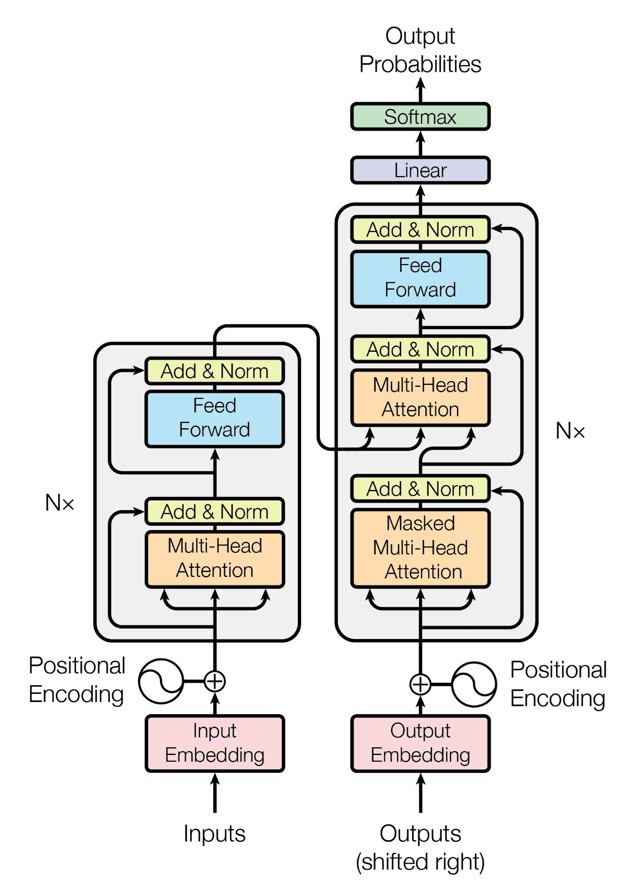

# Dawn of the Transformer

## Introduction

The previous part of the series presents traditional NLP models. This part will concern itself with the best NLP model up to date, completely new architecture that will be built from scratch.

This notebook will introduce the transformer architecture in the order of input to output.

Transformer architecture is also a multi-encoder-multi-decoder architecture. Some models also only contains the encoder part, which is used for tasks like text classification, whereas some models only contain the decoder part, which is used for tasks like text generation. For machine translation, both encoder and decoder should be used since the text generation and text understanding are both required.

## The Transformer Architecture for Machine Translation

### General Structure

We firstly must clearly state the input and output of the transformer architecture in the case of machine translation.

The input of the encoder the transformer architecture is a sequence of tokens, of shape `[batch_size, src_len]`, whilst the decoder accepts an input of shape `[batch_size, trg_len]`. The transformer model will output a sequence of tokens, of shape `[batch_size, trg_len, trg_vocab]`, which can later be arg-maxed into `[batch_size, trg_len]`, with each token id in the second dimension being the next token of that position in the decoder input sequence.

For example, if the input of the decoder is `<bos>, Attention, is, all, you`, with `<bos>` as the beginning of the sentence, the output of the transformer model will be `Attention, is, all, you, need`.

Then, this part introduces the transformer structure by breaking it down into several parts.

The general structure is as follows,



Which can be expressed as,

```
enc_out = enc_in |> input_block |> [multi_head_self_attention |> add_and_norm |> feed_forward |> add_and_norm] * N

dec_out = [(dec_out |> multi_head_self_attention |> add_and_norm |> feed_forward |> add_and_norm, enc_out) |> multi_head_cross_attention |> add_and_norm |> feed_forward |> add_and_norm] * N |> un_embedding_block
```

where `N` is the number of layers in the transformer architecture, `|>` is pipe, and `[...]` is the list of functions that are applied in order.

### Input Block

Embedding and tokenization have already been introduced in previous parts.

Except for the normal tokenization and embedding, another important part of the input is the positional encoding in the transformer architecture.

The necessity of positional encoding is justified by the fact that the transformer architecture does not have any recurrence or convolution, in other words, it doesn't process the input token-by-token, and thus it fails to capture the position of the tokens in the input sequence.

To deal with the problem, instead of sending in only the embeddings of the tokens, the positional encoding is added to the embeddings. The positional encoding is a vector that is added to the embeddings of the tokens, and it is calculated by the following formula,

$$PE_{(pos, 2i)} = \sin(pos / 10000^{2i / d_{model}})$$

$$PE_{(pos, 2i+1)} = \cos(pos / 10000^{2i / d_{model}})$$

where $pos$ is the position of the token in the input sequence, $i$ is the index of the dimension of the positional encoding, and $d_{model}$ is the dimension of the model, which equals the dimension of the embeddings.

This equal may seem arbitrary, but it is chosen to make the positional encoding have a smooth curve, which means that the positional encoding will have a similar value for similar positions.

In addition, the positional coding using the sine and cosine functions is chosen because the model can learn to attend to relative positions, since the sine of the sum of two angles can be expressed as a function of the sines and cosines of the angles, and so is the cosine.

### Multi-head Attention

#### Cross Attention

If an attention layer requires to pay attention to a sequence based on another sequence, it is called cross attention. For example, the decoder in the machine translation task should pay attention to the encoder output in order to process the output of previous decoder layers.

The cross attention is calculated by the following formula,

$$
Q = YW^Q \\
K = XW^K \\
V = XW^V \\
$$

So the cross attention can be calculated the same as the self-attention, but the queries are based on the desired output shape.

#### The Mask Technique

There is another trick that improves the self-attention mechanism.

The `mask` is used to prevent the model from attending to the future tokens in the input sequence. The `mask` is a matrix that is added to the attention scores, and it is calculated by the following formula,

$$
\text{mask}_{ij} = \begin{cases} -\infty & \text{if } j > i \\ 0 & \text{otherwise} \end{cases}
$$

where $i$ is the row index and $j$ is the column index of the matrix.

So the `mask` is added to the attention scores before the soft-max function is applied to the attention scores, and the model won't attend to the future tokens in the input sequence.

Furthermore, for special tokens like the padding token, the `mask` is also used to prevent the model from attending to the padding tokens, which can be done by setting the `mask` value to $-\infty$ for the padding tokens.

So to conclude, the mask should be,

$$
\text{mask}_{ij} = \begin{cases} -\infty & \text{if } j > i \text{ or } \text{input}[i] \text{ is } \text{padding token} \\ 0 & \text{otherwise} \end{cases}
$$

And `mask` should be applied to the attention scores before the soft-max function is applied to the attention scores.

### Add and Norm

The add and norm operation is a layer that is added after every sub-layer in the transformer architecture. The add and norm operation is defined as,

$$\text{AddAndLayerNorm}(x)=\text{LayerNorm}(x + \text{SubLayer}(x))$$

where $x$ is the input to the sub-layer, and $\text{SubLayer}(x)$ is the output of the sub-layer.

This operation is used to prevent the model from exploding or vanishing gradients, and it is also used to stabilize the training process.

Residual connections is beneficial for gradient flow because it allows the gradients to flow through the network without vanishing or exploding.

This step will be applied after every layer in the transformer architecture. So it will not be repeated in the following sections.

### Feed Forward

The feed forward layer is a simple layer that is used to transform the input to a higher dimension. The feed forward layer is defined as,

$$\text{FFN}(x) = \text{ReLU}(xW_1 + b_1)W_2 + b_2$$

where $x$ is the input to the feed forward layer, $W_1$ and $W_2$ are the weights of the feed forward layer, and $b_1$ and $b_2$ are the biases of the feed forward layer.

The layer is basically just a traditional multi-layer linear neural network with a ReLU activation function.

### Un-Embedding Block

Un-embedding block is the same as previous parts. It just converts from embedding back to vocabulary vector, and if needed, further into token ids.

## Implementation

### Positional Encoding

```python
class PositionalEncoding(nn.Module):
    def __init__(self, embedding_dim, max_len=512):
        super(PositionalEncoding, self).__init__()
        
        pe = torch.zeros(max_len, embedding_dim)
        position = torch.arange(0, max_len, dtype=torch.float).unsqueeze(1)
        div_term = torch.exp(torch.arange(0, embedding_dim, 2).float() * (-math.log(10000.0) / embedding_dim))
        
        pe[:, 0::2] = torch.sin(position * div_term)
        pe[:, 1::2] = torch.cos(position * div_term)
        
        pe = pe.unsqueeze(0).transpose(0, 1)  # [max_len, 1, embedding_dim]
        self.register_buffer('pe', pe)
        
    def forward(self, x):
        x = x + self.pe[:x.size(0), :]
        return x  # [seq_len, batch_size, embedding_dim]
```

### Input Block

```python
class PositionalEncoding(nn.Module):
    def __init__(self, embedding_dim: int, max_len: int=1024):
        super(PositionalEncoding, self).__init__()
        
        pe = torch.zeros(max_len, embedding_dim)
        position = torch.arange(0, max_len, dtype=torch.float).unsqueeze(1)
        div_term = torch.exp(torch.arange(0, embedding_dim, 2).float() * (-np.log(10000.0) / embedding_dim))
        
        pe[:, 0::2] = torch.sin(position * div_term)
        pe[:, 1::2] = torch.cos(position * div_term)
        
        pe = pe.unsqueeze(0).transpose(0, 1)  # [max_len, 1, embedding_dim]
        self.register_buffer('pe', pe)
        
    def forward(self, x):
        x = x + self.pe[:x.size(0), :]
        return x  # [seq_len, batch_size, embedding_dim]
```

### Add and Norm

```python
class AddAndNorm(nn.Module):
    
    def __init__(self, embed_d, dropout=0.1):
        super(AddAndNorm, self).__init__()
        self.norm = nn.LayerNorm(embed_d)
        self.dropout = nn.Dropout(dropout)
    
    def forward(self, x, y):
        return self.norm(x + self.dropout(y))
```

### Attention

```python
class MultiHeadAttn(nn.Module):
    def __init__(self, d_model, num_heads, dropout=0.1):
        super(MultiHeadAttn, self).__init__()
        assert d_model % num_heads == 0, "d_model must be divisible by num_heads"
        
        self.d_model = d_model
        self.num_heads = num_heads
        self.d_k = d_model // num_heads
        self.scale = 1 / np.sqrt(self.d_k)
        
        self.W_q = nn.Linear(d_model, d_model)
        self.W_k = nn.Linear(d_model, d_model)
        self.W_v = nn.Linear(d_model, d_model)
        self.W_o = nn.Linear(d_model, d_model)
        
        self.dropout = nn.Dropout(dropout)
        
    def scaled_dot_product_attention(self, q, k, v, mask=None):
        attn_scores = torch.matmul(q, k.transpose(-2, -1)) * self.scale
        if mask is not None:
            attn_scores = attn_scores.masked_fill(mask == 0, -1e9)
        attn_probs = torch.softmax(attn_scores, dim=-1)
        output = torch.matmul(attn_probs, v)
        return output
        
    def split_heads(self, x):
        batch_size, seq_length, d_model = x.size()
        return x.view(batch_size, seq_length, self.num_heads, self.d_k).transpose(1, 2)
        
    def combine_heads(self, x):
        batch_size, _, seq_length, d_k = x.size()
        return x.transpose(1, 2).contiguous().view(batch_size, seq_length, self.d_model)
        
    def forward(self, x, y, mask=None):
        Q = self.split_heads(self.W_q(x))
        K = self.split_heads(self.W_k(y))
        V = self.split_heads(self.W_v(y))
        
        attn_output = self.scaled_dot_product_attention(Q, K, V, mask)
        output = self.W_o(self.combine_heads(attn_output))
        return self.dropout(output)
```

### Feed Forward

```python
class FF(nn.Module):
    
    def __init__(self, dim: int, hidden_dim: int, dropout: float):
        super(FF, self).__init__()
        self.sq = nn.Sequential(
            nn.Linear(dim, hidden_dim),
            nn.ReLU(),
            nn.Linear(hidden_dim, dim)
        )
        self.dropout = nn.Dropout(dropout)
    
    def forward(self, x):
        return self.dropout(self.sq(x))
```

### Encoder Block

```python
class EncBlock(nn.Module):
    
    def __init__(self, d: int, num_heads: int, hidden_dim: int, dropout: float):
        super(EncBlock, self).__init__()
        self.mha = MultiHeadAttn( d, num_heads, dropout)
        self.ff = FF(d, hidden_dim, dropout)
        self.add_norm1 = AddAndNorm(d, dropout)
        self.add_norm2 = AddAndNorm(d, dropout)
    
    def forward(self, x, y, mask=None):
        x = self.add_norm1(x, self.mha(x, y, mask))
        return self.add_norm2(x, self.ff(x))
```

### Decoder Block

```python
class DecBlock(nn.Module):
    
    def __init__(self, d: int=512, num_heads: int=8, hidden_dim: int=1024, dropout: float=0.1):
        super(DecBlock, self).__init__()
        self.mha = MultiHeadAttn(d, num_heads, dropout)
        self.add_and_norm1 = AddAndNorm(d, dropout)
        self.cross_mha = MultiHeadAttn(d, num_heads, dropout)
        self.add_and_norm2 = AddAndNorm(d, dropout)
        self.ff = FF(d, hidden_dim, dropout)
        self.add_and_norm3 = AddAndNorm(d, dropout)
    
    def forward(self, x, y, src_mask=None, trg_mask=None):
        x = self.add_and_norm1(x, self.mha(x, x, trg_mask))
        x = self.add_and_norm2(x, self.cross_mha(x, y, src_mask))
        x = self.add_and_norm3(x, self.ff(x))
        return x
```

### Mask generator

```python
def generate_mask(src, tgt):
    src_mask = (src != 0).unsqueeze(1).unsqueeze(2)
    tgt_mask = (tgt != 0).unsqueeze(1).unsqueeze(3)
    seq_length = tgt.size(1)
    nopeak_mask = (1 - torch.triu(torch.ones(1, seq_length, seq_length, device=device), diagonal=1)).bool()
    tgt_mask = tgt_mask & nopeak_mask
    return src_mask, tgt_mask
```

### Transformer

```python
class Transformer(nn.Module):
    
    def __init__(self, src_vocab: int, tgt_vocab: int, d: int=512, num_heads: int=8, hidden_dim: int=2048, num_enc: int=6, num_dec: int=6, dropout: float=0.1):
        super(Transformer, self).__init__()
        self.src_embed = InputBlock(d, src_vocab)
        self.tgt_embed = InputBlock(d, tgt_vocab)
        self.encs = nn.ModuleList([
            EncBlock(d, num_heads, hidden_dim, dropout) for _ in range(num_enc)
        ])
        self.decs = nn.ModuleList([
            DecBlock(d, num_heads, hidden_dim, dropout) for _ in range(num_dec)
        ])
        self.fc = nn.Linear(d, tgt_vocab)
    
    def forward(self, src, trg):
        # src: (batch_size, src_len)
        # trg: (batch_size, trg_len)
        src_mask, trg_mask = generate_mask(src, trg)
        src = self.src_embed(src)
        trg = self.tgt_embed(trg)
        
        for enc in self.encs:
            src = enc(src, src, src_mask)
        for dec in self.decs:
            trg = dec(trg, src, src_mask, trg_mask)
        
        return self.fc(trg)
```

## Conclusion

This part introduces the transformer architecture, which is the best NLP model up to date. The transformer architecture is a multi-encoder-multi-decoder architecture, and it is used for tasks like machine translation, text classification, and text generation.

However, the dictionary of the provided data is not used. But we are calling it an end now. The introduction of dictionary can be done by using fine-tuning techniques, manual intervenes, etc.